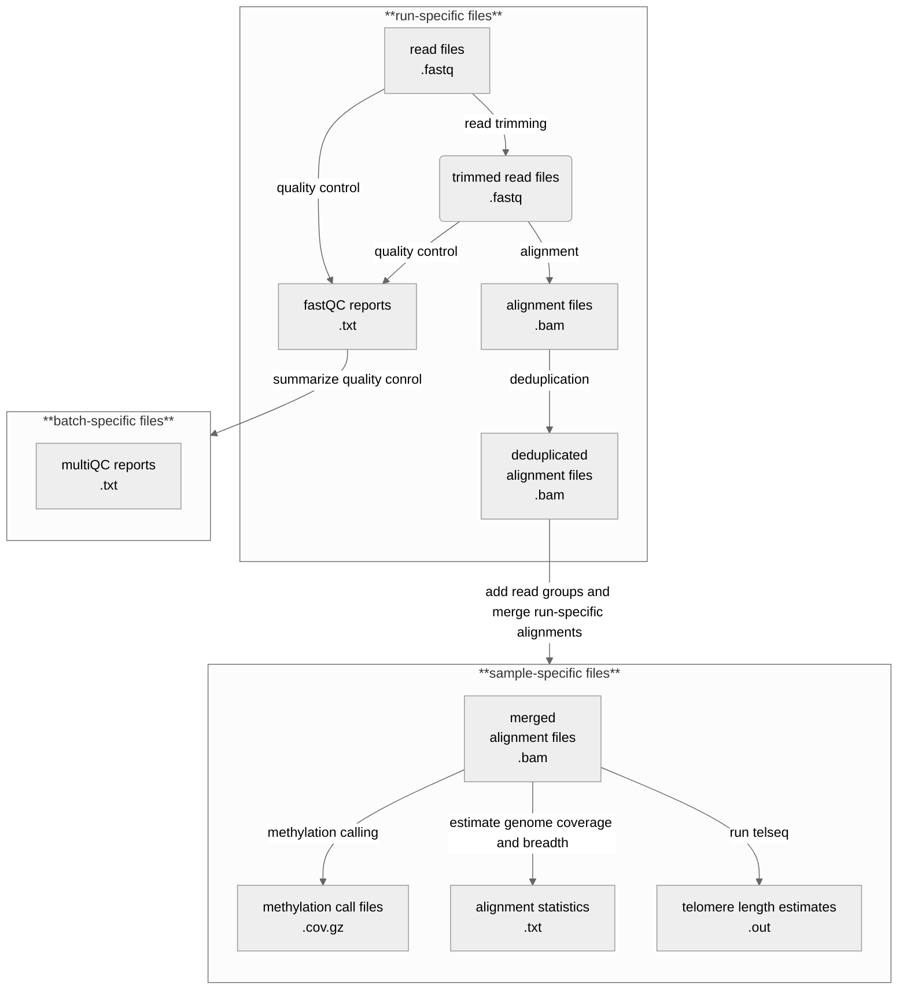

# Nextflow pipeline for bioinformatic processing of Soay Sheep whole-genome bisulfite sequencing data

## Nextflow files and pipeline structure

For details on how nextflow works, please reference the [nextflow documentations](https://training.nextflow.io/latest/) as well as Nextflow's [basic concepts in the fundamentals training](https://training.nextflow.io/latest/basic_training/intro/). In short, a Nextflow workflow is made by joining together different processes, executed independently and isolated from each other. The only way they can communicate is via asynchronous first-in, first-out (FIFO) queues, called `channels`. In other words, every input and output of a process is represented as a channel. The interaction between these processes, and ultimately the workflow execution flow itself, is implicitly defined by these `input` and `output` declarations.

### Workflow files

The following files define the workflow execution flow:
- The `workflow file` *script.nf* defines the pipeline input parameters (`params`), loads the relevant processes from the workflow modules, and defines the channels, i.e. the input and output declarations for all processes. 
- The `workflow module files` are located in *modules/* and include the relevant processes for (1) quality control (*qc.nf*), (2) alignment, deduplication, and methylation calling with [Bismark](http://felixkrueger.github.io/Bismark/) (*bismark.nf*), (3) alignment formatting (*alignment_tools.nf*), (4) estimation of bisulfite conversion (*add_ons.nf*), and (5) estimation of telomere length with [telseq](https://github.com/zd1/telseq) (*telseq.nf*).
- The `config file` *nextflow.config* contains the pipeline cnfiguration.

### Pipeline overview



**Sequencing strategy**: <br>
The samples from the main sequencing run (n=872) were sequenced in three batches (sequencing batches). Samples within the first sequencing batch (batch1) were sequenced in 3 runs, while samples within the second and third sequencing batch, were either sequenced in 2, 3 or 4 runs. To facilitate the bioinformatic processing, samples within the second and third sequencing batch were redistributed into new pipeline batches:
- batch2: samples sequenced in 2 runs
- batch3: samples sequenced in 3 runs
- batch4: samples sequenced in 4 runs

The samples from the pilot sequencing run (n=224) were sequenced in one batch in 3 runs.

As the numbers of runs per sample differ between pipeline batches, a small adjustemnt within the process that merges alignments (process `PICARDMERGE` in *modules/alignment_tools.nf*) is required. The number of input alignment must be adjusted when calling `picard MergeSamFiles`: <br>

For samples with three runs (batch1, batch3 and pilot), use
```
picard -Xmx4096m MergeSamFiles I=${alignments[0]} I=${alignments[1]} I=${alignments[2]} O=align_merge_${sample_id}_logs/${sample_id}.merged.bam TMP_DIR=align_merge_${sample_id}_logs/temp SORT_ORDER=queryname
```

and for samples with e.g. four runs (batch 4) use

```
picard -Xmx4096m MergeSamFiles I=${alignments[0]} I=${alignments[1]} I=${alignments[2]} I=${alignments[3]} O=align_merge_${sample_id}_logs/${sample_id}.merged.bam TMP_DIR=align_merge_${sample_id}_logs/temp SORT_ORDER=queryname
```

To facilitate this, I created branches that are specific for the number of runs per sample. WHen running the pipeline, please fetch the correct branch before running the pipeline.
- two runs: `tworuns`
- three runs: `threeruns`
- four runs: `fourruns`


```
process PICARDMERGE {
    tag "PICARDMERGE on $sample_id"

    input:
    tuple val(sample_id), path(alignments)

    output:
    tuple val(sample_id), path("align_merge_${sample_id}_logs/${sample_id}.merged.bam")

    script:
    """
    mkdir align_merge_${sample_id}_logs
    mkdir align_merge_${sample_id}_logs/temp
    picard -Xmx4096m MergeSamFiles I=${alignments[0]} I=${alignments[1]} I=${alignments[2]} O=align_merge_${sample_id}_logs/${sample_id}.merged.bam TMP_DIR=align_merge_${sample_id}_logs/temp SORT_ORDER=queryname
    """
}
```


## small note on running the pipeline on HPC:

To run nextflow on STANAGE (HPC), load the module: `module load Nextflow/23.10.0`

To submit (launch or resume) nextflow to slurm, use: `sbatch launch_nf.sh /users/bi1ml/pipelines/next_wgbs/script.nf /users/bi1ml/pipelines/next_wgbs/nextflow.config "INSERT_SEQUENCING_BATCH" "INSERT_PIPELINE_BATCH"` or `sbatch resume_nf.sh /users/bi1ml/pipelines/next_wgbs/script.nf /users/bi1ml/pipelines/next_wgbs/nextflow.config "INSERT_SEQUENCING_BATCH" "INSERT_PIPELINE_BATCH"`\
For example, to submit the first second (pieline-)batch of samples from the first sequencing batch, run: `sbatch launch_nf.sh /users/bi1ml/pipelines/next_wgbs/script.nf /users/bi1ml/pipelines/next_wgbs/nextflow.config "first_batch" "b1.4"`

The pipeline is run in batches of 40 samples. After each run, files musst be moved from staged to the shared area. This has to be executed on a login node (and thus cannot be part of the pipeline) as the shared are is not accessible from working nodes on STANAGE.

To move files, run `./stage_to_shared.sh INSERT_STAGEDIR INSERT_NEXTFLOWDIR "INSERT_BATCH"` on a login-node (Working nodes cannot access the `/shared` area). Prrovide the path to stage directory, path to local nextflow directory (home) and pipeline batch.\

To clear stage, work and project directories, run: `./clean.sh INSERT_PUBLICDIR INSERT_HOMEDIR`. Prrovide the path to nextflow directory on parscratch and, path to local nextflow directory (home).


